# TF2DeepFloorplan [](https://www.gnu.org/licenses/gpl-3.0) [](https://colab.research.google.com/github/zcemycl/TF2DeepFloorplan/blob/master/deepfloorplan.ipynb)
This repo contains a basic procedure to train and deploy the DNN model suggested by the paper ['Deep Floor Plan Recognition using a Multi-task Network with Room-boundary-Guided Attention'](https://arxiv.org/abs/1908.11025). It rewrites the original codes from [zlzeng/DeepFloorplan](https://github.com/zlzeng/DeepFloorplan) into newer versions of Tensorflow and Python. 
<br>
Network Architectures from the paper, <br>
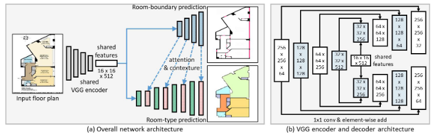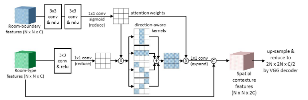

## Requirements
Install the packages stated in `requirements.txt`, including `matplotlib`,`numpy`,`opencv-python`,`pdbpp`, `tensorflow-gpu` and `tensorboard`. <br>
The code has been tested under the environment of Python 3.7.4 with tensorflow-gpu==2.3.0, cudnn==7.6.5 and cuda10.1_0. Used Nvidia RTX2080-Ti eGPU, 60 epochs take approximately 1 hour to complete.

## How to run?
1. Install packages via `pip` and `requirements.txt`.
```
pip install -r requirements.txt
```
2. According to the original repo, please download r3d dataset and transform it to tfrecords `r3d.tfrecords`.
3. Run the `train.py` file  to initiate the training, model weight is stored as `log/store/G`, 
```
python train.py [--batchsize 2][--lr 1e-4][--epochs 1000]
[--logdir 'log/store'][--modeldir 'model/store']
[--saveTensorInterval 10][--saveModelInterval 20]
```
- for example,
```
python train.py --batchsize=8 --lr=1e-4 --epochs=60 
--logdir=log/store --modeldir=model/store
```
4. Run Tensorboard to view the progress of loss and images via, 
```
tensorboard --logdir=log/store
```
5. Convert model to tflite via `convert2tflite.py`.
```
python convert2tflite.py [--modeldir model/store]
[--tflitedir model/store/model.tflite]
[--quantize]
```
6. Download and unzip model from google drive, 
```
gdown https://drive.google.com/uc?id=1czUSFvk6Z49H-zRikTc67g2HUUz4imON # log files
unzip log.zip 
gdown https://drive.google.com/uc?id=1RsfN-XhikuVRtrkkELWH0ZzuICb9axlX # pb + tflite files
unzip model.zip
```
7. Deploy the model via `deploy.py`, please be aware that load method parameter should match with weight input.
```
python deploy.py [--image 'path/to/image']
[--postprocess][--colorize][--save 'path/to/output_image']
[--loadmethod 'log'/'pb'/'tflite']
[--weight 'log/store/G'/'model/store'/'model/store/model.tflite']

```
- for example,
```
python deploy.py --image floorplan.jpg --weight log/store/G 
--postprocess --colorize --save output.jpg --loadmethod log
```

## Docker for API
1. Build and run docker container. 
```
docker build -t tf_docker -f Dockerfile .
docker run -d -p 1111:1111 tf_docker:latest 
docker run --gpus all -d -p 1111:1111 tf_docker:latest 
```
2. Call the api for output.
```
curl -H "Content-Type: application/json" --request POST  \
  -d '{"uri":"https://cdn.cnn.com/cnnnext/dam/assets/200212132008-04-london-rental-market-intl-exlarge-169.jpg","colorize":1,"postprocess":0}'  \
  http://0.0.0.0:1111/process --output out.jpg 
curl --request POST -F "file=@/home/yui/Pictures/4plan/tmp.jpeg;type=image/jpeg" \
  -F "postprocess=0" -F "colorize=0"  http://0.0.0.0:1111/process --output out.jpg
```

## Google Colab 
1. Click on [](https://colab.research.google.com/github/zcemycl/TF2DeepFloorplan/blob/master/deepfloorplan.ipynb) and authorize access.
2. Run the first code cell for installation.
3. Go to Runtime Tab, click on Restart runtime. This ensures the packages installed are enabled.
4. Run the rest of the notebook.

## Results
- From `train.py` and `tensorboard`.

|Compare Ground Truth (top)<br> against Outputs (bottom)|Total Loss|
|:-------------------------:|:-------------------------:|
|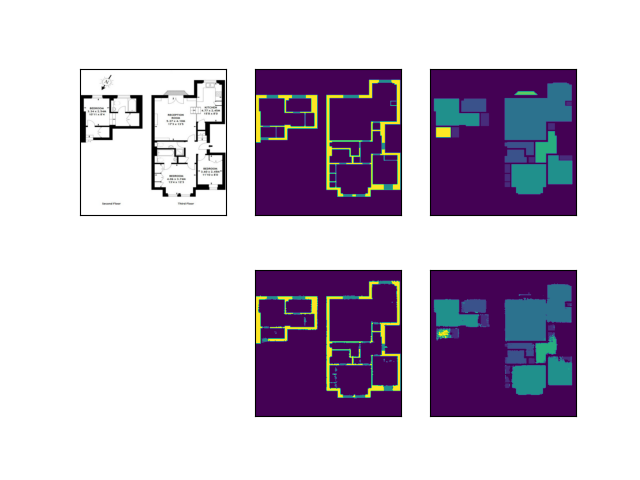|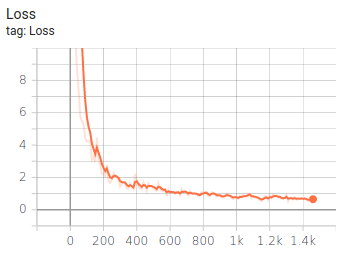|
|Boundary Loss|Room Loss|
|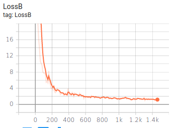|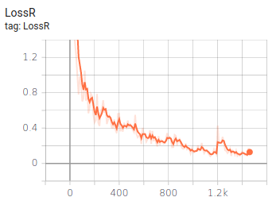|

- From `deploy.py` and `utils/legend.py`.

|Input|Legend|Output|
|:-------------------------:|:-------------------------:|:-------------------------:|
|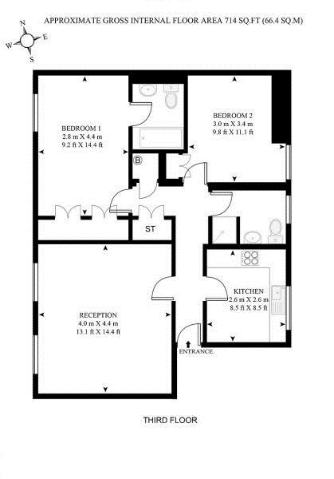|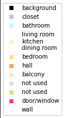|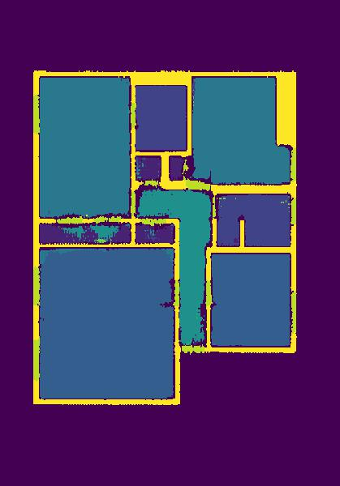|
|`--colorize`|`--postprocess`|`--colorize`<br>`--postprocess`|
|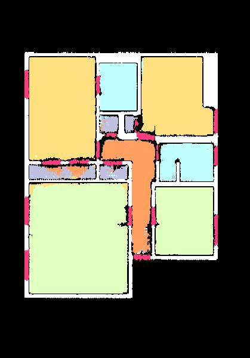||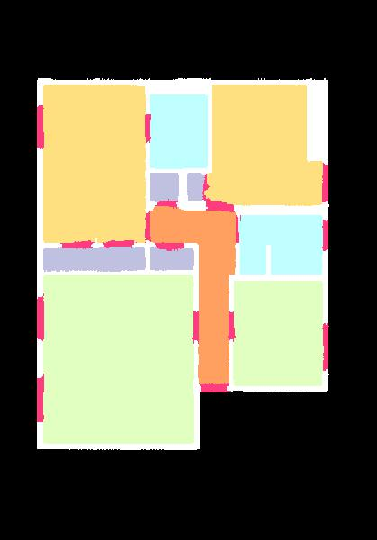|
